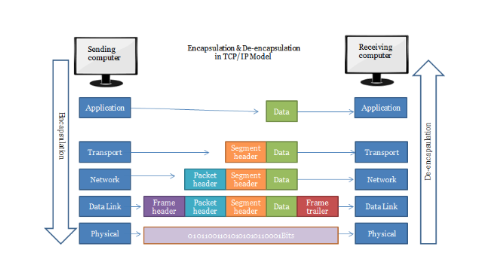

**[Vietnamese Below]**

### Data Encapsulation and Decapsulation on the Source Machine

#### I. Data Flow
The process of encapsulating data on the source machine proceeds as follows:

1. **Data Preparation**: The application program prepares data in the form of bytes.
2. **Data Transmission**: The program sends the byte stream to the TCP or UDP protocol.
3. **Creating PDU**:
   - The TCP/UDP protocol generates its own PDU (segment or datagram) from the received data.
   - This PDU is then passed to the IP protocol, which encapsulates the data for end-to-end communication.

4. **Creating Packet**: The IP protocol creates a packet based on the PDU provided by TCP/UDP and passes it to the network card, encapsulating the data for host-to-host communication.

5. **Creating Frame**: The network card generates a frame by adding a frame header and a frame trailer around the packet. Finally, the frame is converted into signals to be transmitted over the network, facilitating communication within the LAN.

  

#### II. Data Decapsulation on the Destination Machine
The process of decapsulating data on the destination machine occurs in reverse order:

1. **Signal Conversion**: The network card converts the received signals into frames.
2. **Removing Header and Trailer**: The Ethernet protocol removes the frame's header and trailer to create a packet and forwards it to the IP protocol.
3. **Removing IP Header**: The IP protocol removes the packet's header to extract the SDU (Service Data Unit) and passes it to the TCP/UDP protocol.
4. **Retrieving Data**: The application calls TCP/UDP to retrieve the byte stream data. The TCP/UDP protocol removes its header to extract the SDU and delivers it to the application.
5. **Data Conversion**: Finally, the application converts the SDU byte stream into user data.

This process ensures efficient encapsulation and decapsulation of data, enabling seamless communication between devices in the network.

### Đóng mở dữ liệu trên máy nguồn

#### I. Luồng đi của dữ liệu
Quá trình đóng gói dữ liệu trên máy nguồn diễn ra như sau:

1. **Chuẩn bị dữ liệu**: Chương trình ứng dụng chuẩn bị dữ liệu ở dạng byte.
2. **Gửi dữ liệu**: Chương trình chuyển chuỗi byte dữ liệu đó cho giao thức TCP hoặc UDP.
3. **Tạo PDU**: 
   - Giao thức TCP/UDP sẽ tạo ra PDU riêng (segment hoặc datagram) từ dữ liệu đã nhận.
   - PDU này sau đó được chuyển tiếp cho giao thức IP, thực hiện việc đóng gói dữ liệu phục vụ truyền thông end-to-end.

4. **Tạo Packet**: Giao thức IP tạo packet dựa trên PDU mà TCP/UDP đã chuyển xuống và tiếp tục chuyển cho card mạng, thực hiện đóng gói dữ liệu phục vụ truyền thông host-to-host.

5. **Tạo Frame**: Card mạng tạo frame bằng cách thêm frame header vào đầu và frame trailer vào cuối dựa trên packet phía trên. Cuối cùng, frame được chuyển thành tín hiệu để đưa lên đường truyền, phục vụ truyền thông trong mạng LAN.

  

#### II. Quá trình mở gói dữ liệu trên máy đích
Quá trình mở gói dữ liệu trên máy đích diễn ra theo thứ tự ngược lại:

1. **Chuyển tín hiệu**: Tín hiệu được card mạng chuyển thành frame.
2. **Cắt bỏ header và trailer**: Giao thức Ethernet cắt bỏ header và trailer của frame để tạo ra packet và chuyển cho giao thức IP.
3. **Cắt bỏ header IP**: Giao thức IP cắt bỏ phần header của packet để lấy SDU (Service Data Unit) và chuyển cho giao thức TCP/UDP.
4. **Lấy dữ liệu**: Chương trình gọi tới TCP/UDP để lấy chuỗi byte dữ liệu. Giao thức TCP/UDP tự cắt bỏ header để lấy riêng phần SDU và chuyển cho chương trình.
5. **Chuyển đổi dữ liệu**: Cuối cùng, chương trình chuyển đổi chuỗi byte SDU thành dữ liệu người dùng.

Thông qua quy trình này, dữ liệu được đóng gói và mở gói một cách hiệu quả, đảm bảo quá trình truyền thông diễn ra suôn sẻ giữa các thiết bị trong mạng.
