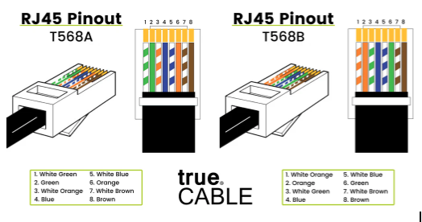

# Kết nối phần cứng mạng

## Card mạng

- **Tên gọi khác**: Network Interface Card (NIC) là thiết bị cho phép kết nối thiết bị đầu cuối với môi trường truyền dẫn.
- Trên thiết bị đầu cuối, NIC có thể được tích hợp sẵn trên bo mạch chính, kết nối qua khe mở rộng **PCI** (Peripheral Component Interconnect - chuẩn giao tiếp để kết nối các thiết bị ngoại vi với bo mạch chủ của máy tính) hoặc qua cổng **USB** (Universal Serial Bus).
- Trên mỗi NIC có các giao thức mạng để trao đổi dữ liệu, chạy trên phần cứng của NIC.
- **Đơn vị dữ liệu** mà card mạng xử lý là frame, bao gồm:
  - **Frame** = Frame header + Payload (do IP gửi xuống).
  - Frame là dạng dữ liệu số gần sát nhất với tín hiệu vật lý (các bit của frame chuyển đổi trực tiếp sang tín hiệu vật lý và ngược lại).
- **Loại tín hiệu** mà card mạng làm việc bao gồm tín hiệu điện, quang, và sóng vô tuyến, giao diện kết nối phụ thuộc vào môi trường truyền. Thông thường, mỗi NIC chỉ kết nối với một môi trường.

### Chức năng của Card mạng
- Chuyển dữ liệu lên mạng: chuyển chuỗi byte của frame thành tín hiệu rồi đưa lên môi trường truyền.
- Thu tín hiệu từ môi trường truyền và chuyển tín hiệu thành chuỗi byte frame để xử lý trên thiết bị đầu cuối hoặc thiết bị mạng.
- Kiểm soát luồng dữ liệu giữa máy tính và môi trường truyền.

### Địa chỉ MAC
- Mỗi card mạng có một địa chỉ duy nhất gọi là địa chỉ vật lý hoặc **địa chỉ MAC** (Media Access Control), được gán vào ROM của NIC.
- **Địa chỉ MAC** là một số nguyên 48 bit (6 byte), biểu diễn bằng 12 chữ số hexa và được chia thành hai phần:
  - **OUI** (Organizationally Unique Identifier): 24 bit đầu (6 chữ số đầu) xác định nhà sản xuất hoặc nhà cung cấp của NIC.
  - **NIC Specific**: 24 bit còn lại (6 chữ số sau) là số seri duy nhất của thiết bị do nhà sản xuất gán.
- Địa chỉ MAC là duy nhất trên toàn cầu, đảm bảo không có hai thiết bị nào có cùng địa chỉ MAC.
- Khi máy tính khởi động, địa chỉ MAC được tải vào RAM để các giao thức sử dụng, nhằm xác định xem một gói tin trên mạng có dành cho mình hay không để xử lý hoặc loại bỏ.
- Địa chỉ MAC của thiết bị gửi và nhận cũng nằm trong chuỗi byte của frame dữ liệu và được các thiết bị như bridge hoặc switch sử dụng.

## Kết nối cáp xoắn

- Để kết nối cáp xoắn với thiết bị mạng hoặc với card mạng của thiết bị đầu cuối, sử dụng **đầu kết nối và cổng RJ45**.
  - **Đầu kết nối RJ45**: chuẩn quốc tế để gắn vào cáp.
  - **Cổng RJ45 (port)**: dùng để gắn đầu kết nối vào thiết bị.
- **Dây dẫn** của cáp xoắn ghép với các lá đồng của đầu nối RJ45 theo thứ tự nhất định, gọi là chuẩn bấm cáp.
- Hai chuẩn bấm cáp phổ biến:
  - **T568A**
  - **T568B**

  

- **Cáp mạng** bấm bằng kìm bấm dây cáp mạng.
  - Nếu hai đầu cùng chuẩn: gọi là **cáp thẳng**.
  - Hai đầu khác chuẩn: gọi là **cáp chéo**.
  - **Cáp thẳng** dùng để nối các thiết bị khác loại, **cáp chéo** dùng để nối các thiết bị cùng loại.

## Kết nối không dây

- Kết nối không dây được thực hiện giữa thiết bị đầu cuối với một thiết bị mạng gọi là **điểm truy cập không dây** (Wireless Access Point).
- Cần có một **card mạng hỗ trợ kết nối không dây** được gắn vào khe mở rộng PCI trên mainboard hoặc qua cổng USB, cùng phần mềm điều khiển (driver) riêng.
- Nhiều thiết bị đầu cuối có thể cùng kết nối đến một điểm truy cập không dây, tạo thành một **mạng LAN hỗn hợp không dây**.
