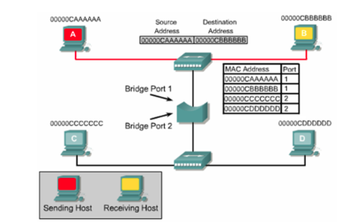

**[Vietnamese Below]**

## Bridge and Switch

### Bridge
- A **Bridge** is a LAN device with two ports capable of forwarding data frames between network segments based on the MAC addresses of the sender and receiver.
- **Functions of a Bridge**:
  - Connects two or more independent network segments, with each port of the bridge connecting to a different segment.
  - When receiving a frame:
    - If the destination MAC address is in the same segment as the source, the bridge filters the frame to avoid network congestion.
    - If the destination MAC address is in another segment, the bridge forwards the frame to the corresponding segment.
  - The bridge maintains a **MAC address table** to store device addresses and updates this table when receiving new frames.

  

- **Types of Bridges**:
  - **Transparent Bridge**: Connects two LANs using the same technology; forwards frames without altering their structure.
  - **Translational Bridge**: Connects two LANs using different technologies; converts frames between network technologies before forwarding.

### Switch
- A **Switch** is a LAN device with multiple ports that forwards data frames between devices based on MAC addresses. It can be considered a **bridge with multiple RJ45 ports** or **a bridge + hub**.
- Switches allow:
  - Connecting multiple terminal equipments and other network devices via cables (crossover cables for similar devices, straight-through cables for different devices).
  - Expanding a LAN to form a larger network.
  - When multiple switches are used, they are often housed in **rack cabinets** for protection and ventilation.
- **How a Switch Works**:
  - Upon receiving a frame from a port, the switch forwards the frame to the appropriate port based on the source and destination MAC addresses in the frame.
  - The switch uses a **switching table** to store device MAC addresses and their corresponding ports. This table is built automatically as devices exchange packets on the network.
  - After identifying the destination port, the switch forwards the frame to that port and retransmits it as a signal.
- **Switch Forwarding Modes**:
  - **Store-and-Forward**: Waits until the entire frame is received to check for errors. Frames with errors are not transmitted, increasing reliability but causing slight delays.
  - **Cut-Through**: Forwards frames immediately after reading the MAC address—faster but may forward erroneous frames.
- **Advantages of Switches**:
  - Improves network performance by directing signals only to the destination device, reducing data collisions.
  - Switches are widely used today:
    - Home networks often use 3- to 8-port switches.
    - Businesses typically use 12- to 48-port switches, which require rack cabinets with ventilation fans.

## Bridge và Switch

### Bridge (Cầu nối)
- **Bridge** là thiết bị mạng LAN với 2 cổng, có khả năng chuyển tiếp frame dữ liệu giữa các phân đoạn mạng dựa trên địa chỉ MAC của thiết bị gửi và nhận.
- **Chức năng của Bridge**:
  - Kết nối hai hoặc nhiều phân đoạn mạng độc lập, mỗi cổng của bridge kết nối với một phân đoạn mạng khác.
  - Khi nhận được một frame:
    - Nếu địa chỉ MAC đích nằm cùng phân đoạn với nguồn gửi, bridge sẽ chặn (filter) frame để tránh làm tắc nghẽn mạng.
    - Nếu địa chỉ MAC đích nằm ở phân đoạn khác, bridge sẽ chuyển tiếp (forward) frame đến phân đoạn tương ứng.
  - Bridge lưu trữ địa chỉ MAC của các thiết bị trong **bảng địa chỉ MAC (MAC address table)** và cập nhật bảng này khi nhận frame mới.

  

- **Phân loại Bridge**:
  - **Bridge giao vận**: Kết nối hai mạng LAN cùng công nghệ, chỉ chuyển frame mà không thay đổi cấu trúc.
  - **Bridge biên dịch**: Kết nối hai mạng LAN khác công nghệ, chuyển đổi frame giữa các công nghệ mạng trước khi chuyển tiếp.

### Switch (Bộ chuyển mạch)
- **Switch** là thiết bị mạng LAN với nhiều cổng, thực hiện chuyển tiếp frame dữ liệu giữa các thiết bị dựa trên địa chỉ MAC, có thể hiểu là **bridge + hub** hoặc **bridge với nhiều cổng RJ45**.
- Switch cho phép:
  - Kết nối nhiều thiết bị đầu cuối và thiết bị mạng khác qua cáp (cùng loại dùng cáp chéo, khác loại dùng cáp thẳng).
  - Mở rộng mạng LAN, cho phép tạo một mạng lớn.
  - Khi có nhiều switch, chúng thường được đặt trong **tủ rack** để bảo vệ và cố định, tủ có quạt thông gió.
- **Cách thức hoạt động của Switch**:
  - Khi nhận frame từ một cổng, switch chuyển frame đến cổng tương ứng dựa trên địa chỉ MAC nguồn và đích trong frame.
  - Switch sử dụng **bảng chuyển mạch** để lưu trữ địa chỉ MAC của thiết bị và số cổng tương ứng. Bảng này được học tự động qua các gói tin trao đổi trên mạng.
  - Sau khi xác định được cổng đích, switch chuyển tiếp frame đến cổng tương ứng và truyền lại thành tín hiệu.
- **Chế độ chuyển tiếp của Switch**:
  - **Lưu và chuyển tiếp (Store and forward)**: Switch chờ nhận đủ frame để kiểm tra lỗi, nếu frame lỗi sẽ không phát -> tăng độ an toàn nhưng có độ trễ.
  - **Cut-through**: Chuyển tiếp ngay sau khi nhận được địa chỉ MAC -> nhanh hơn nhưng có thể để lọt frame lỗi.
- **Ưu điểm của Switch**:
  - Tăng hiệu suất mạng do tín hiệu chỉ truyền đến thiết bị đích, giảm xung đột dữ liệu.
  - Switch rất phổ biến hiện nay:
    - Gia đình thường dùng switch 3-8 cổng.
    - Doanh nghiệp thường dùng switch 12-24-48 cổng, yêu cầu tủ rack có quạt thông gió.
