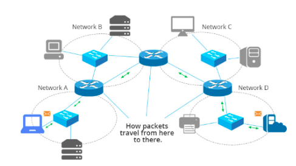

## Router (Bộ định tuyến)

### Định nghĩa và Chức năng
- **Router** là thiết bị mạng với nhiều cổng, giúp ghép nối các mạng LAN hoặc WAN với nhau, tạo thành một liên mạng lớn.
- Khác với các thiết bị mạng trước đó chủ yếu kết nối thiết bị trong cùng một mạng, router **kết nối các mạng khác nhau** để thiết lập một hệ thống liên mạng.
- Router là thiết bị phức tạp nhất trong các thiết bị mạng, hoạt động như một máy tính chuyên dụng với các thành phần như **ROM, RAM, CPU**, và các cổng mạng, tuy nhiên không có các thiết bị đầu vào như chuột, bàn phím hay màn hình. **Quản trị viên** cần dùng một máy tính khác để cấu hình router.
- Router có các **module** làm việc với nhiều công nghệ mạng khác nhau như Ethernet, cáp quang, và có thể gắn thêm module tùy theo yêu cầu kết nối.

### Hoạt động của Router
- Router có một hệ điều hành (OS) riêng với các phần mềm giao thức cài sẵn, nhưng không cho phép cài phần mềm ứng dụng.
- Trong một mạng LAN, mỗi thiết bị phải có địa chỉ IP riêng trong cùng một dải IP. Khi kết nối hai mạng LAN có dải địa chỉ IP khác nhau, **router là thiết bị cần thiết** để kết nối chúng, cho phép thiết bị ở mạng này giao tiếp với thiết bị ở mạng khác.

  

### Cách thức làm việc của Router
- Mỗi cổng của router tương đương một **card mạng** với địa chỉ MAC và IP riêng, phù hợp với mạng mà nó kết nối.
- Các bước router thực hiện khi chuyển tiếp gói tin IP:
  - **Thu nhận tín hiệu từ mạng nguồn** và chuyển thành frame dữ liệu.
  - **Phân tích địa chỉ IP** của gói tin để xác định cổng đích.
  - **Chuyển tiếp gói tin IP** tới mạng đích dựa trên địa chỉ IP trong bảng định tuyến (routing table).
  - **Đóng gói gói tin IP vào frame** và đưa lên mạng đích.

- Chuyển tiếp gói tin IP là nhiệm vụ quan trọng nhất, **quá trình này được gọi là định tuyến (routing)**.

### Định tuyến (Routing)
- Định tuyến là quá trình **tìm kiếm và xác định đường đi tốt nhất** để gói tin IP tới được đích.
- Trong một liên mạng lớn, có nhiều đường đi giữa hai thiết bị đầu cuối thuộc hai mạng khác nhau, **router phải dùng bảng định tuyến** để xác định đường đi cho gói tin.
- **Bảng định tuyến**:
  - **Định tuyến tĩnh**: Cấu hình thủ công bảng định tuyến, phù hợp với mạng nhỏ, cấu trúc cố định.
  - **Định tuyến động**: Sử dụng **giao thức định tuyến (routing protocol)** để tự động cập nhật bảng định tuyến, phù hợp với mạng lớn hoặc cấu trúc thay đổi.
  - Các giao thức định tuyến phổ biến: **RIP, IGRP, EIGRP, IS-IS, OSPF**, giúp router chia sẻ thông tin về trạng thái mạng và xây dựng bảng định tuyến.

### Ứng dụng của Router
- **Trong mạng LAN**: Router kết nối nhiều mạng LAN nhỏ thành một hệ thống mạng lớn, tăng hiệu suất và tính an toàn.
- **Trong mạng gia đình**: Router thường tích hợp thêm các chức năng như **wifi access point và switch** để kết nối mạng LAN gia đình với mạng WAN của ISP.
- **Trong mạng doanh nghiệp**: Router kết nối các bộ phận khác nhau trong một doanh nghiệp, đồng thời cung cấp kết nối Internet băng thông cao qua mạng WAN.
- **Trong hệ thống liên mạng ISP**: Router kết nối các mạng WAN của các nhà cung cấp dịch vụ, tạo thành một mạng trải rộng toàn cầu - Internet.

### Tóm tắt
- Router là thiết bị quan trọng bậc nhất cho cả mạng LAN và WAN.
- Router thực hiện kết nối các mạng khác nhau, cho phép liên lạc giữa các thiết bị trong các mạng khác nhau.
- Router giúp tạo ra mạng toàn cầu Internet thông qua việc kết nối hàng triệu mạng WAN và LAN.

