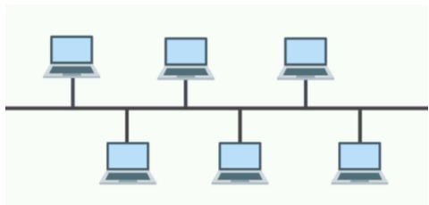
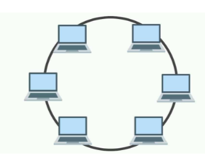
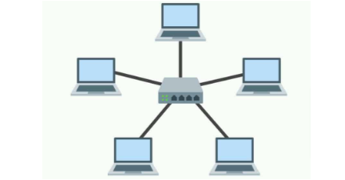
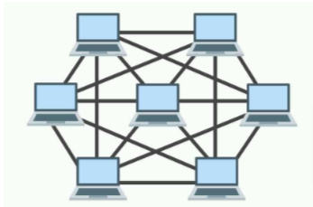

**[Vietnamese Below]**

## Network Topology

### Definition
Network topology is the geometric arrangement of links and nodes in a computer network. It describes how data is transmitted between nodes in the network. There are two types of network topology:
1. **Physical topology**: Focuses on the physical arrangement of devices.
2. **Logical topology**: Concentrates on the data transmission model between nodes.

### Basic Physical Topologies

1. **Bus Topology**

  

   - **Description**: All end devices connect to and share a common transmission line, which can be a twisted-pair or coaxial cable. Both ends of the cable are terminated with a **Terminator** to prevent signal loss.
   - **Operation**: When an end device transmits data, it sends packets along the shared line. All devices receive the packet, but only the intended recipient processes it.
   - **Advantages**:
     - Simple to set up and cost-effective.
     - Efficient for small networks with fewer devices and cables.
     - Easy to disable a device without affecting others.
     - Can be expanded by connecting cables from two linear networks.
   - **Disadvantages**:
     - Poor performance with many devices.
     - Slow speeds and prone to bottlenecks.
     - High packet loss rate; a cable break divides the network.
     - Adding devices reduces network efficiency.

2. **Ring Topology**

  

   - **Description**: All end devices are connected in a closed-loop. Repeaters are used to ensure signal integrity over longer distances.
   - **Operation**: Packets are transmitted in a specific direction through the loop, stopping at the intended device for processing.
   - **Advantages**:
     - Reduces collision as packets move in a single direction.
     - Adding devices does not affect performance.
     - Moderate installation and expansion costs with good data speeds.
   - **Disadvantages**:
     - Devices require a token to transmit data.
     - Slower speeds compared to bus topology.
     - Difficult to add devices and troubleshoot issues.

3. **Star Topology**

  

   - **Description**: All end devices are connected to a central device (hub or switch).
   - **Operation**: The central device receives and distributes packets to the intended recipients.
   - **Advantages**:
     - High reliability; a single cable failure does not affect the entire network.
     - High performance; no collisions if the central device is a switch.
     - Easy to install, expand, and troubleshoot.
   - **Disadvantages**:
     - Requires more cables than bus or ring topologies.
     - Relies heavily on the central device; failure renders the network inoperable.
     - Higher installation costs due to the central device.

4. **Mesh Topology**

  

   - **Description**: Devices are connected to each other pairwise through transmission media. There are two types:
     - **Partial Mesh**: Not all devices are interconnected.
     - **Full Mesh**: Every device is connected to every other device.
   - **Operation**: Data is sent directly from the sender to the receiver via dedicated connections.
   - **Advantages**:
     - A device failure does not affect the entire network.
     - No bandwidth contention due to direct connections.
     - Easy troubleshooting and high security.
     - Adding or removing devices does not disrupt the network.
   - **Disadvantages**:
     - High installation costs due to the need for extensive cabling and equipment.

### Hybrid Topology
Combining multiple topologies to create a **hybrid network topology** that leverages the advantages and mitigates the disadvantages of each model.

---

## Cấu trúc liên mạng (Topology)

### Định nghĩa
Cấu trúc liên mạng (hay còn gọi là topology) là sự sắp xếp hình học của các liên kết và các node trong một mạng máy tính. Nó mô tả cách mà dữ liệu được truyền giữa các node trong mạng. Có hai loại cấu trúc liên kết mạng: 
1. **Cấu trúc vật lý**: nhấn mạnh đến cách bố trí vật lý của các thiết bị.
2. **Cấu trúc logic**: tập trung vào mô hình truyền dữ liệu giữa các node.

### Các mô hình cấu trúc vật lý căn bản

1. **Cấu trúc tuyến tính - Bus Topology**

  

   - **Mô tả**: Tất cả thiết bị đầu cuối kết nối và sử dụng chung một đường cáp truyền tín hiệu. Đường cáp có thể là cáp xoắn hoặc cáp đồng trục. Hai đầu cáp được gắn thiết bị đặc biệt gọi là **Terminator** để ngăn chặn mất tín hiệu.
   - **Hoạt động**: Khi thiết bị đầu cuối muốn truyền dữ liệu, nó sẽ gửi gói tin lên đường truyền. Tất cả thiết bị nhận gói tin nhưng chỉ thiết bị có địa chỉ định danh trùng mới xử lý.
   - **Ưu điểm**:
     - Dễ lắp đặt và giá thành thấp.
     - Hoạt động hiệu quả với ít thiết bị, số lượng cáp ít.
     - Dễ dàng vô hiệu hóa kết nối của một thiết bị mà không ảnh hưởng đến các thiết bị khác.
     - Dễ dàng mở rộng bằng cách kết nối cáp của hai mạng tuyến tính.
   - **Nhược điểm**:
     - Không hoạt động tốt với nhiều thiết bị.
     - Tốc độ chậm, dễ bị nghẽn cổ chai.
     - Tỉ lệ mất gói tin cao, nếu cáp đứt thì mạng bị chia nhỏ.
     - Thêm thiết bị vào làm giảm hiệu năng hoạt động của mạng.

2. **Cấu trúc vòng - Ring Topology**

  

   - **Mô tả**: Tất cả thiết bị đầu cuối kết nối với nhau thành một mạch tròn khép kín. Nếu có nhiều thiết bị, các repeater sẽ được lắp thêm để đảm bảo tín hiệu không bị suy yếu.
   - **Hoạt động**: Gói tin được truyền theo một hướng nhất định đến từng thiết bị, khi đến thiết bị có địa chỉ trùng thì được xử lý.
   - **Ưu điểm**:
     - Giảm xung đột khi truyền tin do gói tin được truyền theo một chiều nhất định.
     - Thêm thiết bị đầu cuối không ảnh hưởng đến hiệu năng.
     - Giá thành lắp đặt và mở rộng vừa phải, tốc độ truyền dữ liệu tốt.
   - **Nhược điểm**:
     - Thiết bị đầu cuối cần thẻ bài để truyền tin.
     - Tốc độ truyền chậm hơn mạng tuyến tính.
     - Khó khăn trong việc thêm thiết bị và xử lý sự cố.

3. **Cấu trúc hình sao - Star Topology**

  

   - **Mô tả**: Tất cả thiết bị đầu cuối kết nối đến một thiết bị trung tâm (hub hoặc switch).
   - **Hoạt động**: Thiết bị trung tâm nhận gói tin và phân phối đến đúng đích.
   - **Ưu điểm**:
     - Độ tin cậy cao, một dây mạng lỗi không ảnh hưởng đến phần còn lại.
     - Hiệu năng cao, không xung đột nếu thiết bị trung tâm là switch.
     - Dễ lắp đặt và mở rộng, dễ xử lý sự cố.
   - **Nhược điểm**:
     - Sử dụng nhiều cáp hơn so với mạng tuyến tính và vòng.
     - Phụ thuộc vào thiết bị trung tâm; nếu hỏng thì toàn mạng sẽ bị tê liệt.
     - Chi phí lắp đặt cao hơn do chi phí cho thiết bị trung tâm.

4. **Cấu trúc lưới - Mesh Topology**

  

   - **Mô tả**: Các thiết bị đầu cuối kết nối với nhau từng đôi một thông qua môi trường truyền dẫn. Có hai loại: 
     - **Partial Mesh**: Không phải hai thiết bị nào cũng kết nối với nhau.
     - **Full Mesh**: Tất cả các thiết bị đều kết nối với nhau.
   - **Hoạt động**: Khi một thiết bị gửi dữ liệu, nó chuyển trực tiếp gói tin cho thiết bị nhận.
   - **Ưu điểm**:
     - Một thiết bị lỗi không ảnh hưởng đến toàn mạng.
     - Không có vấn đề tranh chấp băng thông do kết nối trực tiếp.
     - Dễ xử lý sự cố và có tính bảo mật cao.
     - Thêm hoặc bớt thiết bị không ảnh hưởng đến toàn mạng.
   - **Nhược điểm**:
     - Chi phí lắp đặt cao do yêu cầu nhiều cáp và thiết bị.

### Mô hình mạng kết hợp
Kết hợp nhiều mô hình mạng trên để tạo ra một **mô hình mạng kết hợp**, nhằm tận dụng ưu điểm và khắc phục nhược điểm của từng mô hình.
