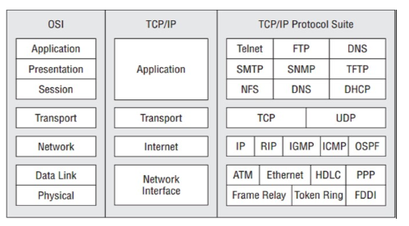

# Mô hình TCP/IP

Là một mô hình tham chiếu, bản mô hình hóa của tập hợp các giao thức, thường gọi là bộ giao thức TCP/IP, đóng vai trò nền tảng trong hoạt động Internet ngày nay. Được đặt tên theo hai giao thức nòng cốt của nó là TCP và IP, được thiết kế dựa theo kiến trúc phân tầng bao gồm các tầng: Tầng liên kết, tầng liên mạng, tầng giao vận và tầng ứng dụng.

## Các Tầng trong Mô hình TCP/IP

1. **Tầng ứng dụng:**
   - Làm việc với dữ liệu người dùng, các giao thức thuộc tầng này sẽ sử dụng một trong hai giao thức của tầng giao vận để truyền thông tin đến điểm cuối. Các giao thức thường gặp là: telnet, FTP, DNS, SMTP, SNMP, TFTP, NFS, DHCP.

2. **Tầng giao vận:**
   - Chứa hai giao thức TCP và UDP, chịu trách nhiệm phục vụ tầng ứng dụng và đảm bảo truyền thông end-to-end. Các giao thức phía trên được thực thi ở dạng phần mềm và cài đặt trực tiếp trong hệ điều hành.

3. **Tầng liên mạng:**
   - Chịu trách nhiệm vận chuyển các gói tin qua mạng. Tầng này chứa tất cả các giao thức định tuyến và giao thức vận chuyển dữ liệu người dùng IP. Các thiết bị hoạt động ở tầng này (thường là router) có nhiệm vụ nhận gói tin IP, xác định điểm đến của gói tin IP, và chuyển gói tin IP về phía máy đích. Tầng này cũng chứa các giao thức gửi và nhận thông báo lỗi và các thông điệp điều khiển. Các giao thức ở tầng này có thể thực hiện ở cả phần cứng và phần mềm; trên máy tính thì được thực hiện ở dạng hàm hệ thống, còn trên router thì được thực hiện ở phần cứng. Thiết bị chủ yếu hoạt động ở tầng này là router.

4. **Tầng liên kết (hoặc tầng giao diện mạng):**
   - Chịu trách nhiệm hoạt động với trình điều khiển thiết bị và các giao diện phần cứng để kết nối máy tính với môi trường truyền. Một số giao thức của tầng liên kết: ATM, Ethernet, PPP, Frame relay, Token Ring, FDDI. Các giao thức ở tầng này hầu hết thực thi trong phần cứng; các thiết bị mạng như hub/repeater, bridge/switch hoạt động ở tầng liên kết.

## So sánh OSI và TCP/IP

Hai mô hình thực tế có sự tương đồng và cả vai trò nhiệm vụ cũng như tên gọi của các tầng. 

- **OSI** sinh ra với mục đích mô tả bất kỳ loại mạng nào, trong khi **TCP/IP** được sinh ra chỉ để mô tả cho bộ giao thức TCP/IP có sẵn.
- Tuy nhiên, hiện nay chỉ còn bộ giao thức TCP/IP được sử dụng làm chuẩn công nghiệp trong mạng máy tính, nên nó được dùng để so sánh hai mô hình mạng.

  

