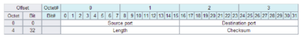

**[Vietnamese Below]**

# UDP Protocol (User Datagram Protocol)

UDP is one of the core protocols of the TCP/IP protocol suite. It provides a connectionless, unreliable, and unverified method of data transmission between computers on a network. This means that UDP does not establish a connection before transmitting data and does not check or correct errors during transmission.

## Role of UDP
UDP is used in applications and services that require high transmission speed and do not need absolute reliability. Some common applications that use UDP include:
- **Streaming media** (e.g., video, audio streaming): These applications prioritize transmission speed over data integrity.
- **Online gaming**: Online games require low latency and fast response times rather than ensuring every data packet is received.
- **DNS (Domain Name System)**: The DNS protocol uses UDP to send and receive queries because it is fast and simple.
- **VoIP (Voice over IP)**: Voice calls over networks use UDP because they require quick and continuous data transmission.

## How UDP Works
- **Connectionless**: UDP does not establish a connection before sending data. Each packet (datagram) is sent independently and unrelated to others.
- **Simple**: UDP is much simpler than TCP. It only adds a small header to each data packet containing basic information such as source port, destination port, packet length, and checksum.
- **Unreliable**: UDP does not guarantee that data packets will arrive at the destination or in the correct order. Packets may be lost or delayed without any mechanism to detect and correct errors.
- **No Flow Control**: UDP lacks a mechanism to control the flow of data, ensuring no matching transmission speeds between sender and receiver.

### Structure of a UDP Packet
A UDP packet (UDP datagram) consists of two parts: the UDP header and the data (payload).

#### UDP Header

  

The header consists of 4 fields, each 16 bits (2 bytes) long:
- **Source Port**: Port number of the sending machine (optional).
- **Destination Port**: Port number of the receiving machine (mandatory).
- **Length**: Total length of the UDP packet, including the header and data.
- **Checksum**: Used for error checking during transmission. It is optional and can be omitted in some cases.

#### Data (Payload)
Contains the actual data that the application wants to transmit.

## Advantages and Disadvantages of UDP

### Advantages
- **Speed**: UDP is faster because it skips connection establishment and complex error-checking mechanisms.
- **Efficiency**: It has less overhead due to a small and simple header.
- **Suitable for Real-Time Applications**: Applications such as video/audio streaming and VoIP require continuous data transmission without high reliability.

### Disadvantages
- **No Guarantee**: Data may be lost, duplicated, or received out of order without any mechanism for error detection and correction.
- **No Flow Control**: There is no mechanism to adjust the transmission rate between sender and receiver.

> **In summary**: UDP is a simple, connectionless, unreliable, and unverified protocol. It is used in applications that prioritize high transmission speed and low latency over data integrity. This makes UDP an ideal choice for real-time applications like streaming media, online gaming, and VoIP.

## Common Application Layer Protocols and Services Using UDP
Includes: DNS, NTP, IP tunneling, RPC, NFS, DHCP, TFTP, IPTV.

## Example of a UDP Packet
Suppose we have a data message "Hello, UDP!" sent from source port 12345 to destination port 80. The message length is 11 bytes.
- **Source Port**: 12345 (0x3039)
- **Destination Port**: 80 (0x0050)
- **Length**: 19 (Header 8 bytes + Data 11 bytes, 0x0013)
- **Checksum**: (Assumed to be 0xF1E2) (calculated based on a pseudo-header)
- **Data (in Hexadecimal)**: 
  - `48 65 6C 6C 6F 2C 20 55 44 50 21`

- **Complete UDP Packet**:
  - `3039 0050 0013 F1E2 4865 6C6C 6F2C 2055 4450 21`

## UDP Security 

- The UDP protocol can be exploited to perform DoS attacks (**Denial of Service** - a form of attack that overloads the server by generating a vast number of requests, leading to overload and shutdown).
- **UDP Flood**: Since UDP is an unreliable connectionless protocol, data can be sent without establishing a connection. An attacker can send a large number of UDP packets to random ports on a server. The server checks and responds with an **ICMP Destination Unreachable**. When the volume of UDP requests exceeds the permissible limit, the server cannot process them, leading to a denial-of-service state.
- Common defenses against UDP floods involve blocking or limiting UDP requests to prioritize resources for other services. Basic firewalls or software firewalls can only handle around 1 million packets per second (pps). When packet volume exceeds this limit, the firewall becomes overloaded.
- To mitigate UDP flood attacks, **high-capacity firewalls** are required to filter and block malicious packets while ensuring the stability of other services.

---

# Giao thức UDP (User Datagram Protocol)

UDP là một trong những giao thức chính của bộ giao thức TCP/IP. Nó cung cấp một phương thức truyền dữ liệu không kết nối, không đảm bảo và không tin cậy giữa các máy tính trên mạng. Điều này có nghĩa là UDP không thiết lập kết nối trước khi truyền dữ liệu và không kiểm tra hoặc sửa lỗi trong quá trình truyền.

## Vai trò của UDP
UDP được sử dụng trong các ứng dụng và dịch vụ cần tốc độ truyền tải cao và không yêu cầu độ tin cậy tuyệt đối. Một số ứng dụng phổ biến sử dụng UDP bao gồm:
- **Streaming media** (ví dụ: video, âm thanh trực tuyến): Các ứng dụng này ưu tiên tốc độ truyền tải hơn là tính toàn vẹn của dữ liệu.
- **Gaming online**: Trò chơi trực tuyến yêu cầu độ trễ thấp và tốc độ phản hồi nhanh hơn là đảm bảo rằng mọi gói dữ liệu đều được nhận.
- **DNS (Domain Name System)**: Giao thức DNS sử dụng UDP để gửi và nhận các truy vấn vì nó nhanh và đơn giản.
- **VoIP (Voice over IP)**: Cuộc gọi thoại qua mạng sử dụng UDP vì cần truyền dữ liệu nhanh và liên tục.

## Cách hoạt động của UDP
- **Không kết nối**: UDP không thiết lập kết nối trước khi gửi dữ liệu. Mỗi gói dữ liệu (datagram) được gửi độc lập và không liên quan đến các gói khác.
- **Đơn giản**: Giao thức UDP đơn giản hơn nhiều so với TCP. Nó chỉ thêm một header nhỏ vào mỗi gói dữ liệu để chứa thông tin cơ bản như cổng nguồn, cổng đích, chiều dài gói và checksum.
- **Không đảm bảo**: UDP không đảm bảo rằng gói dữ liệu sẽ đến nơi đích hoặc đến theo đúng thứ tự. Các gói có thể bị mất hoặc đến trễ mà không có bất kỳ cơ chế nào để phát hiện và sửa lỗi.
- **Không kiểm soát dòng**: UDP không có cơ chế kiểm soát dòng chảy, không đảm bảo tốc độ truyền phù hợp giữa máy gửi và máy nhận.

### Cấu trúc của gói UDP
Một gói UDP (UDP datagram) bao gồm hai phần: UDP header và dữ liệu (payload).

#### UDP header

  

Gồm 4 trường, mỗi trường có độ dài 16 bit (2 byte):
- **Source Port (cổng nguồn)**: Số cổng của máy gửi (tùy chọn).
- **Destination Port (cổng đích)**: Số cổng của máy nhận (bắt buộc).
- **Length (độ dài)**: Tổng chiều dài của gói UDP, bao gồm cả header và dữ liệu.
- **Checksum**: Sử dụng để kiểm tra lỗi trong quá trình truyền. Không phải bắt buộc và có thể bỏ qua trong một số trường hợp.

#### Dữ liệu (payload)
Chứa dữ liệu thực sự mà ứng dụng muốn truyền.

## Ưu điểm và nhược điểm của UDP

### Ưu điểm
- **Tốc độ**: UDP truyền dữ liệu nhanh hơn vì không có bước thiết lập kết nối và không có cơ chế kiểm tra lỗi phức tạp.
- **Hiệu quả**: Ít overhead hơn vì header UDP nhỏ và đơn giản.
- **Thích hợp cho các ứng dụng thời gian thực**: Các ứng dụng như streaming video/audio, VoIP yêu cầu truyền dữ liệu liên tục mà không cần độ tin cậy cao.

### Nhược điểm
- **Không đảm bảo**: Dữ liệu có thể bị mất, trùng lặp hoặc nhận sai thứ tự mà không có cơ chế phát hiện và sửa lỗi.
- **Không kiểm soát dòng**: Không có cơ chế để điều chỉnh tốc độ truyền dữ liệu giữa máy gửi và máy nhận.

> **Tóm lại**: UDP là một giao thức mạng đơn giản, không kết nối, không đảm bảo và không tin cậy. Nó được sử dụng trong các ứng dụng yêu cầu tốc độ truyền tải cao và độ trễ thấp hơn là tính toàn vẹn của dữ liệu. Điều này làm cho UDP trở thành lựa chọn lý tưởng cho các ứng dụng thời gian thực như streaming media, gaming online và VoIP.

## Giao thức và dịch vụ tầng ứng dụng phổ biến sử dụng UDP
Bao gồm: DNS, NTP, IP tunneling, RPC, NFS, DHCP, TFTP, IPTV.

## Ví dụ về gói tin UDP
Giả sử chúng ta có một thông điệp dữ liệu là "Hello, UDP!" được gửi từ cổng nguồn 12345 đến cổng đích 80. Chiều dài của thông điệp là 11 byte.
- **Source Port**: 12345 (0x3039)
- **Destination Port**: 80 (0x0050)
- **Length**: 19 (Header 8 byte + Data 11 byte, 0x0013)
- **Checksum**: (giả sử là 0xF1E2) (được tính dựa trên pseudo-header)
- **Dữ liệu (Data) trong hex**: 
  - `48 65 6C 6C 6F 2C 20 55 44 50 21`

- **Gói tin UDP hoàn chỉnh**:
  - `3039 0050 0013 F1E2 4865 6C6C 6F2C 2055 4450 21`

## Bảo mật UDP 

- Giao thức UDP có thể bị lợi dụng để thực hiện tấn công Dos (**Denial of service** - là hình thức tấn công làm quá tải máy chủ bằng cách tạo ra một lượng rất lớn các truy cập dẫn đến quá tải và ngừng hoạt động)
- **UDP Flood**: do UDP là giao thức kết nối không tin cậy nên không cần thiết lập kết nối vẫn có thể gửi dữ liệu. Do đó, có thể gửi một lượng lớn các gói tin UDP đến một cổng ngẫu nhiên trên server, server sẽ kiểm tra và trả lời với một **ICMP Destination Unreachable**, khi số lượng yêu cầu UDP vượt quá ngưỡng cho phép, máy chủ sẽ mất khả năng xử lý request, dẫn đến tình trạng từ chối dịch vụ
- Thông thường để chống lại UDP flood bằng cách chặn hoặc giới hạn số lượng UDP để ưu tiên tài nguyên cho các dịch vụ khác. Với các hệ thống tường lửa cấp thấp hoặc phần mềm tường lửa sẽ chỉ chịu được gần 1 triệu packet một giây (pps), khi số lượng packet vượt quá mức này hệ thống tường lửa sẽ quá tải.
- Muốn chống lại các cuộc tấn công UDP flood sẽ phải sử dụng các **hệ thống tường lửa** với khả năng xử lý lớn để lọc chặn các gói tin tấn công và duy trì đảm bảo các dịch vụ khác hoạt động ổn định.

