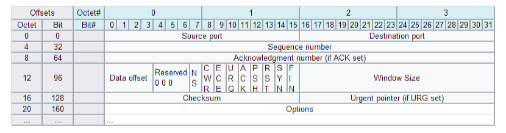

# Giao thức TCP

TCP (Transmission Control Protocol) là một trong những giao thức cốt lõi của bộ giao thức TCP/IP, được thiết kế để cung cấp một kết nối đáng tin cậy giữa các máy tính trong mạng. TCP đảm bảo rằng dữ liệu được truyền tải nguyên vẹn và theo đúng thứ tự.

## Vai trò chính của TCP
- **Đảm bảo truyền tải dữ liệu tin cậy:** TCP bảo đảm rằng các gói tin được nhận theo đúng thứ tự và không bị mất mát.
- **Kiểm soát luồng dữ liệu:** TCP quản lý lưu lượng để tránh quá tải mạng.
- **Kiểm soát lỗi:** TCP sử dụng cơ chế kiểm tra lỗi (checksum) để phát hiện lỗi trong quá trình truyền dữ liệu.
- **Thiết lập và quản lý kết nối:** TCP thiết lập, duy trì và đóng kết nối giữa các máy tính.

## Cách hoạt động của TCP
TCP hoạt động dựa trên cơ chế kết nối (connection-oriented). Dưới đây là các bước chính trong quá trình hoạt động của TCP:

1. **Thiết lập kết nối (Three-Way Handshake):**
   - **SYN:** Máy A gửi một gói tin SYN (synchronize) đến máy B.
   - **SYN-ACK:** Máy B nhận được gói SYN, gửi lại một gói SYN-ACK (synchronize-acknowledge) đến máy A.
   - **ACK:** Máy A nhận được gói SYN-ACK, gửi lại một gói ACK (acknowledge) đến máy B. Kết nối được thiết lập.

2. **Truyền dữ liệu:**
   - Dữ liệu được chia thành các gói tin nhỏ, mỗi gói tin có một số thứ tự (sequence number) để đảm bảo đúng thứ tự khi đến đích.
   - Mỗi gói tin nhận được sẽ được xác nhận bằng một gói ACK từ máy nhận.
   - Nếu máy gửi không nhận được gói ACK trong khoảng thời gian xác định, nó sẽ gửi lại gói tin.

3. **Đóng kết nối:**
   - Máy A gửi một gói FIN (finish) để yêu cầu đóng kết nối.
   - Máy B gửi lại một gói ACK để xác nhận nhận được gói FIN và gửi lại một gói FIN.
   - Máy A gửi một gói ACK cuối cùng để xác nhận nhận được gói FIN từ máy B. Kết nối được đóng.

## Cấu trúc gói tin của TCP
Một gói tin TCP bao gồm nhiều trường, trong đó các trường quan trọng bao gồm:
- **Source Port (16 bit):** Cổng nguồn.
- **Destination Port (16 bit):** Cổng đích.
- **Sequence Number (32 bit):** Số thứ tự của gói tin.
- **Acknowledgment Number (32 bit):** Số xác nhận của gói tin nhận được.
- **Data Offset (4 bit):** Độ dài phần header.
- **Reserved (6 bit):** Dự trữ.
- **Flags (6 bit):** Bao gồm các cờ quan trọng như URG, ACK, PSH, RST, SYN, và FIN.
- **Window (16 bit):** Kích thước cửa sổ cho phép máy nhận điều khiển lưu lượng.
- **Checksum (16 bit):** Kiểm tra lỗi của gói tin.
- **Urgent Pointer (16 bit):** Con trỏ khẩn cấp.
- **Options (nếu có):** Các tùy chọn mở rộng.

  

## Ưu điểm và nhược điểm của TCP
- **Ưu điểm:**
  - **Đáng tin cậy:** Đảm bảo rằng dữ liệu được truyền tải nguyên vẹn và theo đúng thứ tự.
  - **Kiểm soát lỗi:** Phát hiện và xử lý lỗi trong quá trình truyền dữ liệu.
  - **Kiểm soát luồng:** Điều chỉnh lưu lượng dữ liệu để tránh quá tải mạng.
  - **Kết nối hướng trạng thái:** Thiết lập và duy trì kết nối giữa các máy tính.

- **Nhược điểm:**
  - **Độ trễ cao hơn:** Do cần xác nhận từng gói tin và thiết lập kết nối, TCP có độ trễ cao hơn so với các giao thức không kết nối như UDP.
  - **Quá trình xử lý phức tạp:** TCP yêu cầu nhiều tài nguyên và quá trình xử lý phức tạp hơn.
  - **Hiệu suất kém hơn trong một số ứng dụng:** Đối với các ứng dụng yêu cầu truyền dữ liệu nhanh và không cần độ tin cậy cao, TCP có thể không phải là lựa chọn tốt nhất.

## Kết luận
TCP là một giao thức mạnh mẽ và đáng tin cậy cho việc truyền dữ liệu qua mạng. Mặc dù có một số hạn chế, nhưng ưu điểm của TCP trong việc đảm bảo dữ liệu được truyền tải nguyên vẹn và theo đúng thứ tự khiến nó trở thành lựa chọn phổ biến cho nhiều ứng dụng mạng.

## Ví dụ chi tiết về quy trình TCP
### Thiết lập kết nối (TCP Handshake):
Giả sử chúng ta có một ứng dụng muốn gửi thông điệp "Hello, World!" từ máy tính A đến máy tính B.

1. **Bước 1: SYN**
   - Máy A gửi một gói tin SYN (synchronize) đến Máy B.
   - Các thông số trong gói SYN:
     - Source Port: 12345
     - Destination Port: 80
     - Sequence Number: 1000 (giả định)
     - ACK Number: 0 (chưa có ACK)
     - SYN Flag: 1

2. **Bước 2: SYN-ACK**
   - Máy B nhận được gói SYN và phản hồi lại bằng một gói SYN-ACK.
   - Các thông số trong gói SYN-ACK:
     - Source Port: 80
     - Destination Port: 12345
     - Sequence Number: 2000 (giả định)
     - ACK Number: 1001 (Số sequence của gói SYN + 1)
     - SYN Flag: 1
     - ACK Flag: 1

3. **Bước 3: ACK**
   - Máy A nhận được gói SYN-ACK và phản hồi bằng một gói ACK.
   - Các thông số trong gói ACK:
     - Source Port: 12345
     - Destination Port: 80
     - Sequence Number: 1001
     - ACK Number: 2001 (Số sequence của gói SYN-ACK + 1)
     - ACK Flag: 1

Sau khi hoàn tất ba bước này, kết nối TCP được thiết lập và sẵn sàng truyền dữ liệu.

### Truyền Dữ Liệu (TCP Data Transfer):
Giả sử Máy A muốn gửi thông điệp "Hello, World!" đến Máy B.

1. **Bước 1: Gửi Dữ Liệu**
   - Máy A gửi gói tin chứa dữ liệu.
   - Các thông số trong gói dữ liệu:
     - Source Port: 12345
     - Destination Port: 80
     - Sequence Number: 1001
     - ACK Number: 2001
     - Data: "Hello, World!"
     - ACK Flag: 1

2. **Bước 2: Xác Nhận Dữ Liệu (ACK)**
   - Máy B nhận được gói tin và gửi lại một gói ACK để xác nhận đã nhận được dữ liệu.
   - Các thông số trong gói ACK:
     - Source Port: 80
     - Destination Port: 12345
     - Sequence Number: 2001
     - ACK Number: 1013 (Số sequence của gói dữ liệu + kích thước dữ liệu, ở đây là 12 byte)
     - ACK Flag: 1

### Đóng Kết Nối (TCP Teardown):
Sau khi truyền dữ liệu xong, kết nối TCP cần được đóng lại bằng quy trình bốn bước.

1. **Bước 1: FIN**
   - Máy A gửi một gói tin FIN (finish) để yêu cầu đóng kết nối.
   - Các thông số trong gói FIN:
     - Source Port: 12345
     - Destination Port: 80
     - Sequence Number: 1013
     - ACK Number: 2001
     - FIN Flag: 1
     - ACK Flag: 1

2. **Bước 2: ACK**
   - Máy B nhận được gói FIN và phản hồi bằng gửi một gói ACK.
   - Các thông số trong gói ACK:
     - Source Port: 80
     - Destination Port: 12345
     - Sequence Number: 2001
     - ACK Number: 1014 (Số sequence của gói FIN + 1)
     - ACK Flag: 1

3. **Bước 3: FIN**
   - Máy B gửi một gói FIN để xác nhận yêu cầu đóng kết nối của Máy A.
   - Các thông số trong gói FIN:
     - Source Port: 80
     - Destination Port: 12345
     - Sequence Number: 2001
     - ACK Number: 1014
     - FIN Flag: 1
     - ACK Flag: 1

4. **Bước 4: ACK**
   - Máy A nhận được gói FIN và phản hồi bằng một gói ACK cuối cùng.
   - Các thông số trong gói ACK:
     - Source Port: 12345
     - Destination Port: 80
     - Sequence Number: 1014
     - ACK Number: 2002 (Số sequence của gói FIN + 1)
     - ACK Flag: 1

Sau khi hoàn tất các bước này, kết nối TCP giữa Máy A và Máy B được đóng lại.