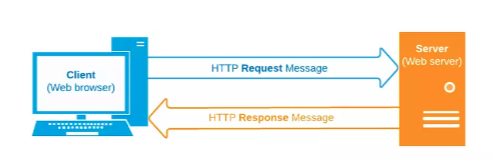
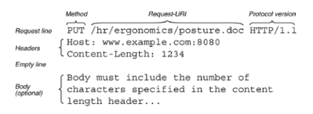

# Hệ thống web và giao thức HTTP 

## Đặc điểm chung của các giao thức tầng ứng dụng: 

- Các giao thức tầng ứng dụng rất đa dạng và luôn đi kèm với ứng dụng sử dụng chúng, các giao thức thường không phải các giao thức chung đa năng phục vụ nhiều loại ứng dụng khác nhau nên khi nói về các giao thức tầng ứng dụng thì phải đi kèm với phần mềm sử dụng nó
- Về cấu trúc gói tin, các giao thức tầng ứng dụng có 2 kiểu: giao thức dựa trên văn bản và giao thức dựa trên chuỗi byte. Giao thức dựa trên văn bản tạo ra gói tin là chuỗi ký tự có định dạng. Ví dụ gói tin HTTP là một chuỗi ký tự lớn. Giao thức dựa trên chuỗi byte tạo ra gói tin là một chuỗi byte, như trong giao thức ICMP
- Các giao thức ứng dụng thường sử dụng một trong hai mô hình truyền thông tin: mô hình truy vấn phản hồi, hoặc mô hình một chiều. Mô hình truy vấn phản hồi chính là chế độ truyền thông bán song công, với dữ liệu có thể truyền 2 chiều nhưng không đồng thời, có một bên chủ động gửi truy vấn và một bên xử lý truy vấn rồi trả lời. Mô hình một chiều chính là chế độ truyền đơn công
- Về phương thức kiểm soát dữ liệu, các giao thức ứng dụng có thể là In-band, tức là lệnh điều khiển gửi kèm với dữ liệu, như trong giao thức HTTP, hoặc là theo kiểu out-of-band, tức là lệnh điều khiển và dữ liệu đi theo những kênh truyền thông riêng, giống như trong giao thức FTP
Tất cả các giao thức ứng dụng phải sử dụng một trong hai dịch vụ truyền thông của tầng giao vận là TCP hoặc UDP. Tùy vào yêu cầu của ứng dụng mà lựa chọn dịch vụ giao vận phù hợp

## Hệ thống web

Là một loại ứng dụng mạng bao gồm hai thành phần chính là web server và web browser. Trong đó

- Web server là một máy tính được thiết lập để chạy các ứng dụng web và cung cấp các tài nguyên như các trang web, tập tin và các ứng dụng trực tuyến khác. Cơ sở dữ liệu là nơi lưu trữ dữ liệu cho các ứng dụng web và cung cấp các dịch vụ truy vấn và lưu trữ dữ liệu
- Web browser là phần mềm cài đặt trên máy tính cá nhân hoặc các thiết bị di động để truy cập các trang web và ứng dụng trên Internet. Nó giúp người dùng truy cập các nội dung trực tuyến, tương tác với các ứng dụng web và sử dụng các dịch vụ trực tuyến khác

### Phân biệt hệ thống web và ứng dụng web

- Hệ thống web là một tập hợp các thành phần và dịch vụ liên kết với nhau, phục vụ nhiều mục đích và chức năng khác nhau. Nó có quy mô lớn và cấu trúc phức tạp.
- Ứng dụng web là một chương trình phần mềm cụ thể chạy trên web browser, thực hiện một hoặc nhiều chức năng cụ thể. Nó có quy mô nhỏ hơn và tập trung vào một số tác vụ nhất định.

Trong một hệ thống web, giao thức HTTP được sử dụng để trao đổi dữ liệu giữa web server và web browser

HTTP hoạt động dựa trên mô hình client-server, trong đó các web browser (client) gửi các yêu cầu đến web server (server), và server trả về các phản hồi HTTP chứa các tài liệu được yêu cầu

  

### Quá trình hoạt động của HTTP

- **Client gửi yêu cầu HTTP đến server**: Khi người dùng nhập địa chỉ URL vào trình duyệt, trình duyệt sẽ tạo yêu cầu HTTP và gửi nó đến server sử dụng các dịch vụ truyền thông của TCP
- **Server nhận yêu cầu HTTP**: Khi server nhận yêu cầu HTTP từ client, nó sẽ xử lý yêu cầu này để trả về tài liệu được yêu cầu
- **Server xử lý yêu cầu HTTP**: Server sẽ kiểm tra yêu cầu HTTP để đảm bảo tính hợp lệ của yêu cầu, xác thực người dùng (nếu cần thiết) và tìm kiếm tài liệu được yêu cầu
- **Server trả về phản hồi HTTP**: Sau khi server xử lý yêu cầu, nó sẽ trả về phản hồi HTTP chứa tài liệu yêu cầu. Phản hồi này bao gồm các tiêu đề HTTP, mã trạng thái và nội dung tài liệu
- **Client nhận phản hồi HTTP**: Sau khi client nhận được phản hồi HTTP, trình duyệt sẽ hiển thị tài liệu được yêu cầu cho người dùng

### Cấu trúc gói tin của HTTP

Giao thức HTTP có hai loại gói tin với cấu trúc khác nhau: 
- gói tin truy vấn (HTTP request)
- gói tin phản hồi (HTTP response)
Mỗi loại gói tin thực chất chỉ là các chuỗi văn bản có định dạng xác định.

**Gói tin truy vấn của HTTP** bao gồm các phần sau:
- Method (phương thức): xác định hành động mà client muốn thực hiện trên tài nguyên của server, ví dụ như GET (lấy thông tin), POST (tạo mới tài nguyên), PUT (cập nhập tài nguyên), DELETE (xóa tài nguyên), cùng nhiều phương thức khác
- URL (Uniform Resource Locator): xác định địa chỉ của tài nguyên mà client muốn truy cập trên server
- Headers (tiêu đề): chứa các thông tin về yêu cầu của client, ví dụ như kiểu dữ liệu yêu cầu, ngôn ngữ yêu cầu, thông tin xác thực và các thông tin khác
- Body (nội dung): chứa các thông tin cụ thể  mà client muốn gửi đến server, ví dụ như dữ liệu form, file tải lên, …

  

