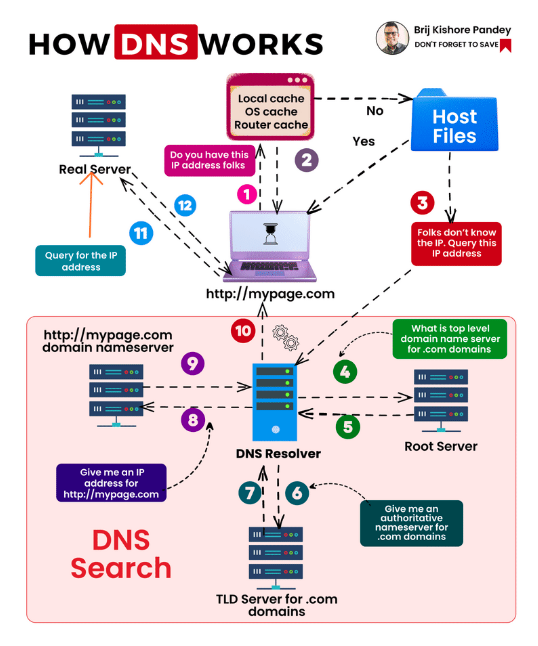

**[Vietnamese Below]**

## DNS (Domain Name System)

### What is DNS?
DNS is the domain name system that translates domain names into IP addresses, enabling network devices to communicate with each other.

### Why is DNS Needed?
- **Easier to Remember**: Domain names are easier to remember and use compared to IP addresses.
- **Stability**: The IP addresses of servers may change, but domain names typically remain constant.
- **Hierarchical and Centralized Management**: DNS organizes domain management hierarchically, from top-level domains (TLDs) to subdomains, simplifying the management and maintenance of the global domain name system.

### DNS System Design
The DNS system includes several types of servers, each with a specific role in resolving domain names:
- **DNS Resolver (Recursive Resolver)**: Found at ISPs or public DNS services (e.g., Google, Cloudflare), these servers receive domain resolution requests from user devices and query other DNS servers to find the corresponding IP address.
- **Root Name Server**: There are 13 root server clusters, each with multiple replicas worldwide. They direct DNS resolvers to the appropriate TLD name servers based on domain extensions such as .com, .net, .org, etc.
- **TLD Name Server**: Located globally and managed by organizations responsible for specific TLDs, these servers direct DNS resolvers to the authoritative name servers of specific domains (e.g., example.com).
- **Authoritative Name Server**: Managed by companies or organizations that own the domains, these servers provide accurate DNS records (A, AAAA, MX, CNAME, TXT, etc.) for the domains they control.

### DNS Name Resolution Process
1. The client enters a domain name in the browser.
2. The browser checks its cache for the IP address corresponding to the domain name. If found, it uses that IP to connect directly; otherwise, it proceeds to the next step.
3. The operating system’s cache is checked for the IP address. If found, it connects directly; otherwise, the next step follows.
4. The browser sends a request to the DNS resolver.
5. The DNS resolver checks its cache for the IP address. If found, it returns the IP to the client. If not, it proceeds.
6. The DNS resolver queries the Root Name Server.
7. The Root Name Server returns the IP address of the TLD Name Server.
8. The DNS resolver queries the TLD Name Server.
9. The TLD Name Server returns the IP address of the Authoritative Name Server.
10. The Authoritative Name Server returns the requested IP address to the DNS resolver.
11. The DNS resolver caches the IP and sends it to the browser, which also caches the IP in the OS and browser caches.
12. The Authoritative Name Server stores detailed DNS records for each specific domain.

### Types of DNS Records and Their Functions
- **A Record (Address Record)**:
  - **Function**: Maps a domain name to an IPv4 address.
  - **Example**: example.com -> 192.0.2.1.
  
- **AAAA Record (IPv6 Address Record)**:
  - **Function**: Maps a domain name to an IPv6 address.
  - **Example**: example.com -> 2001:0db8:85a3:0000:0000:8a2e:0370:7334.
  
- **CNAME Record (Canonical Name Record)**:
  - **Function**: Maps a domain name to another domain name (alias).
  - **Example**: www.example.com -> example.com.
  
- **MX Record (Mail Exchange Record)**:
  - **Function**: Specifies the mail server responsible for receiving emails for the domain.
  - **Example**: example.com -> mail.example.com (priority 10).
  
- **TXT Record (Text Record)**:
  - **Function**: Contains text information for various purposes (SPF, DKIM, etc.).
  - **Example**: example.com -> v=spf1 include:_spf.example.com ~all.
  
- **NS Record (Name Server Record)**:
  - **Function**: Specifies the DNS servers responsible for resolving the domain.
  - **Example**: example.com -> ns1.example.com, ns2.example.com.
  
- **PTR Record (Pointer Record)**:
  - **Function**: Maps an IP address to a domain name (reverse DNS lookup).
  - **Example**: 1.2.0.192.in-addr.arpa -> example.com.
  
- **SRV Record (Service Record)**:
  - **Function**: Identifies servers providing specific services for the domain.
  - **Example**: _sip._tcp.example.com -> 10 60 5060 sipserver.example.com.
  
- **SOA Record (Start of Authority Record)**:
  - **Function**: Contains administrative information about the domain (primary DNS server, admin email, domain serial number, update parameters, etc.).
  - **Example**: example.com -> ns1.example.com admin.example.com 2024061401 3600 1800 1209600 300.
  
- **CAA Record (Certification Authority Authorization Record)**:
  - **Function**: Specifies which certificate authorities (CAs) can issue SSL/TLS certificates for the domain.
  - **Example**: example.com -> 0 issue "letsencrypt.org".

Use the command `dig -t [record_type] [domain_name]` to check record information.

---

## DNS (Domain Name System)

### DNS là gì?
DNS là hệ thống phân giải tên miền, cho phép chuyển đổi tên miền thành địa chỉ IP để các thiết bị mạng có thể giao tiếp với nhau.

### Tại sao cần DNS?
- **Dễ nhớ hơn**: Tên miền dễ nhớ và dễ sử dụng hơn địa chỉ IP.
- **Ổn định**: Địa chỉ IP của các máy thường sẽ có thể thay đổi, còn tên miền thì thường không đổi.
- **Phân cấp và Quản lý Tập trung**: DNS phân cấp quản lý tên miền, từ các tên miền cấp cao nhất (TLD) xuống các tên miền cấp dưới, giúp dễ dàng quản lý và duy trì hệ thống tên miền toàn cầu.

### Thiết kế hệ thống DNS
Hệ thống DNS bao gồm nhiều loại máy chủ, mỗi loại đảm nhận một vai trò cụ thể trong quá trình phân giải tên miền:
- **DNS Resolver (Recursive Resolver)**: Nằm ở những nhà cung cấp dịch vụ Internet (ISP), hoặc có thể là những DNS Resolver công cộng như của Google, Cloudflare, …, có chức năng nhận yêu cầu phân giải tên miền từ các thiết bị người dùng và thực hiện truy vấn qua các DNS server khác để tìm ra địa chỉ IP tương ứng.
- **Root Name Server**: Có 13 cụm máy chủ gốc, mỗi cụm có nhiều bản sao khác nhau được đặt tại các vị trí khác nhau trên toàn cầu, có chức năng hướng dẫn các DNS Resolver tới được các TLD Name Server tương ứng với phần mở rộng tên miền như .com, .net, .org, …
- **TLD Name Server**: Đặt tại nhiều địa điểm trên toàn cầu, thường được quản lý bởi các tổ chức chịu trách nhiệm về từng TLD cụ thể, có chức năng hướng dẫn các DNS Resolver tới được các Authoritative Name Server của tên miền cụ thể (ví dụ như example.com).
- **Authoritative Name Server**: Được quản lý bởi các công ty hoặc tổ chức sở hữu tên miền. Chúng có thể được đặt tại các trung tâm dữ liệu hoặc thông qua các dịch vụ DNS như Cloudflare, AWS Route 53. Có chức năng cung cấp thông tin chính xác về các bản ghi DNS (A, AAAA, MX, CNAME, TXT, v.v.) cho tên miền mà chúng quản lý.

### Quá trình phân giải tên miền DNS
1. Client nhập tên miền vào trình duyệt.
2. Trình duyệt kiểm tra xem trong cache của nó có lưu IP ứng với tên miền đó không. Nếu có, thì dùng IP đó để kết nối đến IP của domain đó luôn. Nếu không, thì đến bước tiếp theo.
3. Trình duyệt kiểm tra xem trong cache của hệ điều hành có IP ứng với tên miền đó không. Nếu có, thì dùng IP đó để kết nối đến IP của domain đó luôn. Nếu không, thì đến bước tiếp theo.
4. Trình duyệt gửi một yêu cầu đến DNS Resolver.
5. DNS Resolver kiểm tra xem trong cache của nó có IP ứng với tên miền đó không. Nếu có, thì trả về IP đó cho client browser. Nếu không, thì đến bước tiếp theo.
6. DNS Resolver gửi request đến Root Name Server.
7. Root Name Server trả về cho DNS Resolver IP của TLD Name Server.
8. DNS Resolver gửi request đến TLD Name Server.
9. TLD Name Server trả về cho DNS Resolver IP của Authoritative Name Server.
10. Authoritative Name Server sẽ trả về địa chỉ IP mà trình duyệt yêu cầu cho DNS Resolver.
11. DNS Resolver lưu IP vào cache và trả về IP tìm được cho trình duyệt, đồng thời trình duyệt và OS cũng lưu thông tin về IP vào cache.
12. Authoritative Name Server lưu trữ chi tiết các bản ghi DNS của từng tên miền cụ thể.

  

### Các loại bản ghi DNS và chức năng của chúng
- **A Record (Address Record)**:
  - **Chức năng**: Ánh xạ một tên miền tới một địa chỉ IPv4.
  - **Ví dụ**: example.com -> 192.0.2.1.
  
- **AAAA Record (IPv6 Address Record)**:
  - **Chức năng**: Ánh xạ một tên miền tới một địa chỉ IPv6.
  - **Ví dụ**: example.com -> 2001:0db8:85a3:0000:0000:8a2e:0370:7334.
  
- **CNAME Record (Canonical Name Record)**:
  - **Chức năng**: Ánh xạ một tên miền tới một tên miền khác (alias).
  - **Ví dụ**: www.example.com -> example.com.
  
- **MX Record (Mail Exchange Record)**:
  - **Chức năng**: Chỉ định máy chủ thư chịu trách nhiệm nhận email cho tên miền.
  - **Ví dụ**: example.com -> mail.example.com (priority 10).
  
- **TXT Record (Text Record)**:
  - **Chức năng**: Chứa thông tin văn bản cho các mục đích khác nhau (SPF, DKIM, v.v.).
  - **Ví dụ**: example.com -> v=spf1 include:_spf.example.com ~all.
  
- **NS Record (Name Server Record)**:
  - **Chức năng**: Chỉ định các máy chủ DNS chịu trách nhiệm phân giải tên miền.
  - **Ví dụ**: example.com -> ns1.example.com, ns2.example.com.
  
- **PTR Record (Pointer Record)**:
  - **Chức năng**: Ánh xạ một địa chỉ IP tới một tên miền (reverse DNS lookup).
  - **Ví dụ**: 1.2.0.192.in-addr.arpa -> example.com.
  
- **SRV Record (Service Record)**:
  - **Chức năng**: Xác định các máy chủ cung cấp dịch vụ cụ thể cho tên miền.
  - **Ví dụ**: _sip._tcp.example.com -> 10 60 5060 sipserver.example.com.
  
- **SOA Record (Start of Authority Record)**:
  - **Chức năng**: Chứa thông tin quản trị về tên miền (máy chủ DNS chính, email của quản trị viên, số sê-ri của tên miền, các thông số cập nhật, v.v.).
  - **Ví dụ**: example.com -> ns1.example.com admin.example.com 2024061401 3600 1800 1209600 300.
  
- **CAA Record (Certification Authority Authorization Record)**:
  - **Chức năng**: Chỉ định các cơ quan chứng nhận (CA) nào được phép phát hành chứng chỉ SSL/TLS cho tên miền.
  - **Ví dụ**: example.com -> 0 issue "letsencrypt.org".

Dùng lệnh `dig -t [record_type] [domain_name]` để kiểm tra thông tin record.
